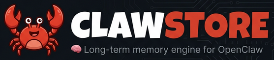

<p align="center">
  
</p>

<p align="center">
  
  
  
  
  
  
</p>

<p align="center"><strong>REMEMBER EVERYTHING. FORGET NOTHING.</strong></p>

---

# clawstore 🦀🧠

A structured long-term memory engine for [OpenClaw](https://github.com/openclaw-ai/openclaw). Built to run on your Mac. No cloud. No GPU. No server.

```
clawstore write "Peter prefers Vim over VS Code" --entity peter
clawstore search "code editor preferences" --mode semantic
→ peter: "Peter prefers Vim over VS Code" (2 minutes ago, score: 0.94)
```


---

## What It Is

OpenClaw is a powerful agent. But it forgets everything between sessions. `clawstore` fixes that.

It gives OpenClaw a persistent, queryable memory: a SQLite database with FTS5 full-text search and `vec0` vector search (real KNN — not a loop). Observations are embedded locally via Ollama. The whole thing runs as a launchd daemon and exposes 6 MCP tools that OpenClaw can call automatically.

This is the difference between an agent that responds to you and one that actually knows you.

---

## Requirements

- macOS (Apple Silicon, M1 or later)
- [Go 1.22+](https://go.dev/dl/)
- [Ollama](https://ollama.com) running locally

```bash
# Pull the embedding model (280MB, runs on Neural Engine)
ollama pull nomic-embed-text
```

> [!WARNING]
> **One-time build setup required.** `clawstore` uses `mattn/go-sqlite3` (CGO) for `vec0` vector search. This driver needs the `fts5` build tag or **the binary will crash at startup** with `no such module: fts5` despite building cleanly.
>
> Run this **once per machine** before building:
> ```bash
> go env -w GOFLAGS="-tags=fts5"
> ```
> If you only use `make build` / `make test`, this is already handled — the Makefile passes `-tags=fts5` automatically.

---

## Install

```bash
git clone https://github.com/saurav0989/clawstore
cd clawstore
make setup
```

`make setup` builds the binary, installs it to `/usr/local/bin/`, and registers a launchd daemon that starts automatically at login.

```bash
clawstore status
```

```
daemon:          running (PID 12345, uptime 0h 0m)
port:            7433
auth:            enabled
data:            ~/.clawstore/store.db (48 KB)

store:
  entities:      0
  observations:  0
  vectors:       0 (0 missing embeddings)
  action_log:    0 entries

ollama:
  status:        connected (http://localhost:11434)
  model:         nomic-embed-text ✓ pulled
  latency:       6ms
  vector_search: enabled (vec0)

last write:      never
last search:     never
```

---

## OpenClaw Integration

Get your token:

```bash
clawstore token
```

Add to your OpenClaw MCP config:

```json
{
  "mcpServers": {
    "clawstore": {
      "url": "http://localhost:7433/mcp",
      "headers": {
        "Authorization": "Bearer cs_your_token_here"
      }
    }
  }
}
```

OpenClaw will discover all 6 memory tools automatically.

---

## CLI

### Writing memories

```bash
# With an entity
clawstore write "Peter prefers dark mode in all apps" --entity peter
clawstore write "OpenClaw: clawstore is the memory layer" --entity openclaw

# Without an entity (general notes)
clawstore write "Reminder: check launchd plist syntax"

# Specify the source
clawstore write "Had a great meeting with Sam today" --entity sam --source human
```

### Reading memories

```bash
clawstore read peter
clawstore read peter --limit 20
clawstore read peter --since 7d
```

### Searching

```bash
# Hybrid (default, recommended — combines semantic + FTS)
clawstore search "editor preferences"

# Semantic KNN via vec0 (meaning-based)
clawstore search "editor preferences" --mode semantic

# Full-text search (keyword-based)
clawstore search "Vim" --mode fts
```

### Entities

```bash
clawstore entity create peter --name "Peter Steinberger" --type person
clawstore entity create openclaw --name "Project OpenClaw" --type project
clawstore entity list
clawstore entity list --type person
clawstore entity show peter
```

Entity types: `person`, `project`, `place`, `preference`, `concept`, `general`

### Action log

```bash
clawstore log append --type tool_call --summary "ran Peekaboo screenshot" --entities "openclaw"
clawstore log tail
clawstore log tail --since 1h
```

### Maintenance

```bash
# Re-embed observations that were written while Ollama was offline
clawstore reembed

# Get your MCP auth token
clawstore token

# Daemon management
clawstore install    # install/reinstall launchd daemon
clawstore status     # full health check
```

---

## MCP Tools

Once connected, OpenClaw can call these directly:

| Tool | What it does |
|---|---|
| `memory_write` | Store an observation, optionally tied to an entity |
| `memory_read` | Get all observations for a specific entity |
| `memory_search` | Semantic + FTS hybrid search across all memory |
| `memory_recent` | Get the most recent observations across all entities |
| `memory_log_action` | Append to the agent action log |
| `entity_list` | List known entities, optionally filtered by type |

All MCP requests require `Authorization: Bearer <token>`. Unauthenticated requests return `401`.

---

## How Search Works

`--mode hybrid` (default): runs both a vec0 KNN query and an FTS5 query, normalizes both score sets to `[0,1]`, and merges them weighted `0.6 semantic + 0.4 FTS`. Best results in practice.

`--mode semantic`: pure `vec0` KNN — `WHERE embedding MATCH vec_f32(?) ORDER BY distance`. Finds conceptually similar observations even with different wording.

`--mode fts`: pure SQLite FTS5 with Porter stemming. Fast, exact, keyword-based.

If Ollama is offline, semantic search gracefully falls back to FTS. Writes still succeed — run `clawstore reembed` when Ollama is back to catch up.

---

## Data & Config

```
~/.clawstore/
  store.db          ← single SQLite file, all data
  daemon.pid        ← managed by daemon, cleaned on shutdown
  daemon.log        ← rotated at 10MB, 3 backups kept

~/.config/clawstore/
  config.json       ← port, token, ollama url/model, data dir
```

To back up all your memories: copy `~/.clawstore/store.db`. That's it.

---

## Architecture

```
OpenClaw (any channel)
    │
    ▼
MCP Client (JSON-RPC over HTTP)
    │  Authorization: Bearer <token>
    ▼
clawstore daemon (localhost:7433)
    │
    ├── store/observations.go  → SQLite + FTS5
    ├── store/vectors.go       → vec0 KNN (sqlite-vec)
    ├── store/entities.go      → entity graph
    ├── store/actionlog.go     → append-only audit log
    └── embed/ollama.go        → nomic-embed-text via Ollama API
```

Everything runs in a single Go process. Idle memory: ~10MB. Embedding latency on M4: ~6ms per observation (Neural Engine).

---

## Contributing

This is designed as core infrastructure for OpenClaw. If you're building a skill or tool that needs to read or write agent memory, use the MCP tools — don't write to the SQLite file directly.

PRs welcome. Open issues for bugs. Don't add features without discussing first — this is intentionally a focused tool.

---

## License

MIT
